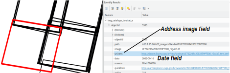
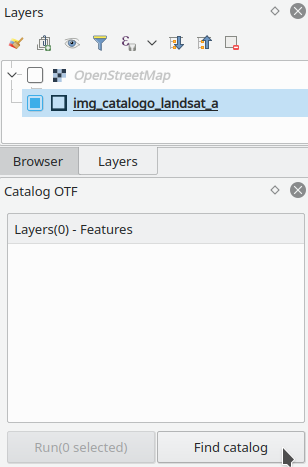
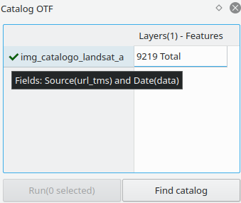
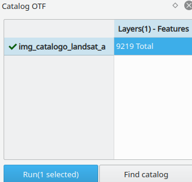
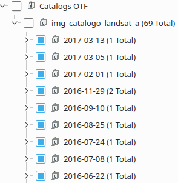
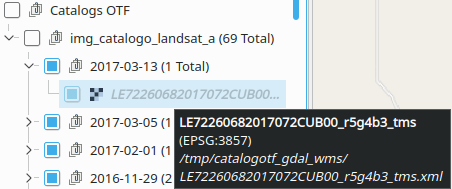
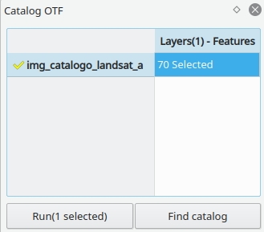

# Catalog On The Fly Plugin  

***Catalog On The Fly*** makes it easy to add images, local or remote, to layers panel from the ***catalog layer***.  

The ***catalog layer***  is a layer with the polygon geometry and the field that have the ***address of image***(required field). Optionally, the layer can have a field with the date of image.  

The ***address of image*** it is a text field that can have a local address(path of local file) or the address of XML in WEB(http://.../file.xml)  

## Steps: ##  

* **Identify the catalogs layers:**  
Add catalog layer in panel layer and "Find catalog".  

* ***Add images from catalogs layers***  
Select the region of interest in map.  
Select the catalogs layers in table and "Run".  

  

## Considerations: ##  

* If catalog layer have the date field, the images will be group by date.

* At present, WEB images are provided only by the TMS server, where the TMS service definition is in an XML file using the [GDAL WMS format](
https://www.gdal.org/frmt_wms.html).  
The XMLs of WEB are copied to a local directory.

* If have features selected in catalog layer, only these features will be use the search.

* For the generation of a local layer catalog, can be use the [Image Footprint Plugin](https://github.com/lmotta/imagefootprint_plugin/wiki).

* Can run multiple catalogs layers at same time.

* Use CTRL+Click to select or deselect items in the table of Catalog On the Fly. If you Click in title of table(Layer..) all items are selected or CTRL+Click for deselect all.